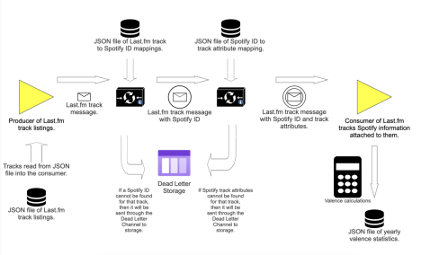

# SpotifyFM 🐪

Since 2006 I have been keeping track of almost every song I have listened to through a web 
application called Last.fm. That has enabled me to generally see the trends in what I've listened to 
since I signed up for the service. Since about 2011, I have used Spotify as my primary music 
service, meaning that any record of a track I have listened to has some presumed Spotify track ID 
associated with it.

With this project, I am creating a messaging service that takes advantage of three datasets I have 
produced using the combination of Last.fm and Spotify data. Based on previous work, I curated a 
list of all the tracks I have listened to, when I listened to them, their respective duration, and 
a handful of features that Spotify calculates for every song in their system. This system will take 
a list of songs I have listened to since 2015 (with 1 out of every 8 of the 140k tracks being used), 
fetch their respective Spotify song IDs, fetch their audio features, and then calculate some metrics 
based on those features.

## General Flow of Application

- Instead of storing the valence statistics to a JSON file, I am printing them to `std.out`.

## Instructions to Run the Application
1. To run this, I use Apache Maven ` 3.9.2` and sync with the sources in the`pom.xml` file.
2. Start ActiveMQ, I'm using version `5.18.1`, using the command `activemq console`.
3. Run the application by running the `main` function in the `Main.java` file.
